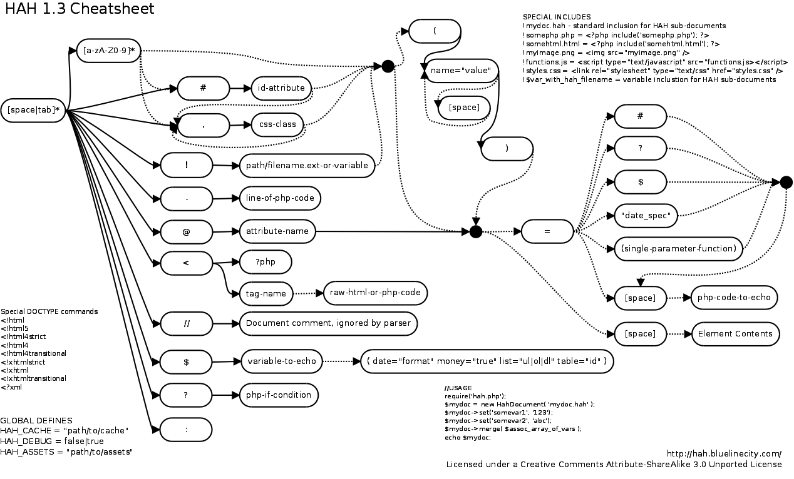

# HAH

HAH Ain't Haml (but it's close) is a PHP parser and renderer for a 
template / domain specific language similar to HAML. It was heavily 
inspired by HAML. I liked the general concept but wanted to take it
a little further by minimizing the number of language constructs you
needed to know as well as make it easier to use in a PHP environment.

Here's a small example of a HAH document.

    <!html
    html
      head
        title My example page
        !styles.css
        !functions.js
    
      body
        #page
           #header
             !banner.png( border="0" alt="My example Page" )
             !topmenu.hah( color="#fff" )
               @pagetype= $pagetype
    
             #message=? $special_message
    
           #main.left
             h1= $welcome_message
             p Here's a list pages on the site
             ul
               - foreach ( $pages as $page )
                 li= $page
    
           #footer
             

                This is the <em>footer</em> for my example page.
             

    
        ? ( $loggedin )
          span= "You are logged in as " . $username
        :
          a( href="login" ) Login Here

This HAH document will produce the following code.

      <!DOCTYPE HTML>
      <html>
        <head>
          <title>My example page</title>
          <link href="styles.css" type="text/css" rel="stylesheet" />
          
        </head>
        <body>
          

            

              
              <?php 
                $__subhahdoc = new HahDocument('.topmenu.hah'); 
                $__subhahdoc->set('color',"#fff"); 
                $__subhahdoc->set('pagetype',$pagetype); 
                echo $__subhahdoc; unset($__subhahdoc);  
              ?>
              <?php if (HahNode::pick($special_message) != '') { ?>
                

                  <?php echo HahNode::pick($special_message); ?>
                

              <?php } ?>
            

            

              <h1><?php echo $welcome_message; ?></h1>
              
Here's a list pages on the site

              <ul>                      
                <?php foreach ( $pages as $page ) { ?>
                  <li><?php echo $page; ?></li>
                <?php } ?>
              </ul>
            

            
         
              
This is the <em>footer</em> for my example page.

            

          

          <?php if (( $loggedin )) { ?>
            <?php echo "You are logged in as " . $username; ?>
          <?php } else { ?>
            <a href="login">Login Here</a>
          <?php } ?>
        </body>
      </html>
  
This example shows a byte reduction from 1,337 to 627. Of course size 
is not the problem HAH is trying to address. HAH is concerned with 
readability and reducing the amount of time and energy required to 
produce PHP templates.

## Documentation

### Using HAH

Using HAH in your programs is pretty easy. Just include the engine file and implement a HahDocument object with the HAH file to load. Then set any external variables and echo the object out.

        require('hah.php');
        
        $mydoc = new HahDocument( 'test.hah' );
        $mydoc->set('somevar1', '123');
        $mydoc->set('somevar2', 'abc');
        
        echo $mydoc;
        
### Get the cheatsheet

### HAH Syntax Tutorial

#### Basics

HAH is similar to HAML ( and python ) in that indentation is what determines the nesting structure. HAH can process either tabs or spaces but it needs to be consistent per file. If you prefer spaces stick with spaces.

There's no need to use special characters to denote an HTML tag. The first non-special character (!-?:<@.#/$) in each line is automatically considered an html/xml tag ( as long as the engine is turned on, more on that later. )

        html
          head
            title My Hah Page
          body
            h1 My Hah Page
            p Some content for my Hah page paragraph.

The content of each html element is what ever follows it.

#### DIV Classes and Id's

Since div tags are so dang cool and versatile there are some shortcuts to utilizing them. Since div tags are commonly used as class and id holders you can use the .classname and #id special characters to create div tags.

        div
           #main
             .firstdivclass This is a first class div
             .seconddivclass This is a second class div
           #footer.someclass
             .centered.gray.copyright This an example of using multiple classes
        This will produce the following code.
        
        

           

             
 This is a first class div 

             
 This is a second class div 

           

           

             
 
               This an example of using multiple classes 
             

           

        

#### HTML Attributes

Specifying HTML attributes are very easy and straight forward. Attributes are listed in a pair of parenthesis which directly follow an html tag specification. ( The opening parenthesis need to directly follow the tag name with no spaces. )

        // Some Links
        a( href="http://yahoo.com" title="Link to Yahoo" ) Yahoo!
        a( href="javascript:void('')'" onclick="alert('hi');") Hi!

One thing to point out here is that HAH comments can be included in your documents using the // characters just like PHP. These lines are skipped by the interpreter.

Attributes can also be added by using the special character (@) along with the attribute name in question as sub-elements under the tag.

        // Some Links
        a( href="http://yahoo.com" ) Yahoo!
            @title A title for the link
            @style text-decoration: none;
    
#### PHP Variables

What good is a PHP DSL if you can't easily integrate PHP output. You can assign PHP variables to HTML elements by immediately following the tag specification with a (=). This tells the engine to basically expect a little line of PHP code. ( Note the contents must have a space between it and the equal-sign )

        table
          tr
            td= $celldata
            td= $celldata + 1
            td( align="left" )= "Some text " . $moretext
            td= myfunction('avar')

There are a couple nifty output filters you can use to make outputting common types of data easier.

         //this outputs a formatted number. ie 1,493,202
         span=# $population
        
         //this outputs a number as currency ie $10,000.00
         span=$ $cost
        
         //this treats the var as a date and formats it according to what's
         //inside the double quotes. NOTE: underscores are required as spaces.
         span="m_d,_Y" $birthday
        
         //this does two things. First it will go down the list of variables
         //and pick the first non-null one. Second if all the variables are
         //null it will not render the tag at all.
         span=? $firstvar, $secondvar, 'last try' 
        
         //the general form of the output filter lets you specify the name of
         //any single parameter function to push the contents through.
         span=(htmlspecialchars) $myhtmlcode
 
#### PHP Variables in HTML Attributes

To set html attribute values with php variables in the same manner as above but using the (@) command.

          a Yahoo!
            @title=? $link_title
            @href= 'http://' . $site

You can also specify inline php using the (@) inside the attribute list.

        a( @title="{$link_title}" @href="http://{$site}" ) Yahoo!

With version 1.3 you can now directly echo out PHP variables without having to use a tag as a container. A variable by itself on a line will be interpreted as an echo statement. You can also control a few aspects on how it's displayed by setting some attributes after the variable name.

        //this echo's out the contents of $myname
        $myname
        
        //this formats the variable as a date using the specified format.
        $dob( date="M d, Y" )
        
        //This will display an array as an unordered list
        $mylist( list="ul" )
        
        //This will display a 2-dimenstional array in a table.
        $data( table="myid" )

Here's a list of the supported attributes you can specify.

* date="dateformat"
* money="true"
* list="ul|ol|dl"
* table="table-html-id"

The table attribute uses the first row as the header. The definition list (dl) will use array keys as the definition term element (dt). You can also create custom single parameter functions in the attributes list. Let's say you have a function named colorize($var) you can pass the variable through it by adding colorize="true".

#### Raw Code

One neat thing about HAH is you can intermix raw HTML and/or PHP code given you maintain proper indentation. This allows for lots of flexibility when you have something that's too difficult to achieve with HAH's syntax.

        html
          head
            title My Hah Page
          body
            h1 My <b>Hah</b> Page
            

              Some content for my Hah page paragraph.
            

            div
              <?php
                 echo 'Some content for the div tag';
              ?>

When HAH encounters a raw tag it temporarily shuts off the parsing engine until it finds a closing tag which matches the indent level of the one that originally triggered the raw code block.

#### Including Documents

Another neat thing about HAH is you can include sub HAH documents as well as PHP, HTML pages using the (!) character command.

  
          #topmenu.menu
            //this tells engine to find the file elements/menu.hah and include it
            !elements/menu.hah

You can pass a set of named parameters ( just like html attributes ) to included HAH documents just like functions. This way you can create reusable HAH documents for common UI elements like forms or navigation.

          form
            !elements/text.hah( label="First Name" id="first_name" )
              @size= $mysize

Here's what elements/text.hah would look like.

          p
            label= $label
              @for= $id
          
            input( type="text" )
              @id= $id
              @name= $id
              @size=? $size  

You can also include HAH documents dynamically by using a PHP variable with the path to the document you'd like to include.

  
        //this tells engine to use the value of $mydoc as the path.
        !$mydoc

#### Simple PHP Lines

To nest HTML in simple php constructs like for/while loops or if/then/else blocks you can use the (-) character.

        ul
          - foreach( $list as $item )
            li= $item
        
        - if ( $test ) 
           span This is true
        - else
           span This is false

Technically you can put any line of php after the (-) character and it will execute it. But let's pretend it doesn't since type of stuff should be in your controller :).

#### Other Neat Tricks

The include operator (!) can also be used to include common external HTML elements such as images, javascript and css. It looks at the file extension and outputs the correct html.

        !functions.js
        !styles.css
        !header.png( width="100" )
        !library.php
        !copyright.html

This will output the following code.

        
        <link rel="stylesheet" type="text/css" href="styles.css" />
        
        <?php include('library.php'); ?>
        <?php include('copyright.html'); ?>

Here's a shortcut for if/then else blocks. It's similar to php's inline conditional operators.

        ul
        ? $test
           span This is true
        : $elseiftest
           span This is false
        :
           span This is neither
